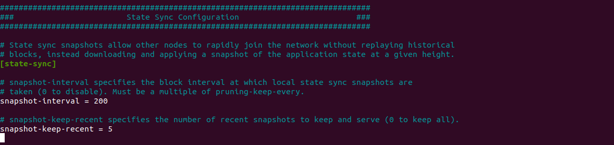
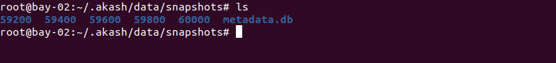

# State sync

In this document, I am providing a basic overview of the sync process of Tendermint/Cosmos. Let me explain, how I used **state sync** to reach consensus, within a fraction of seconds/minutes. I have used this method in [Akash Phase-3 challenge](http://docs.akash.network/testnet-challenges/testnet-challenges/network-support) because Akash is compatible with the new stargate version.

 

Syncing with chain is the process of staying up to date with consensus or up to date with chain.

## Types

- Normal sync
- Fast sync
- State sync

### Normal sync

Normal sync, as a general we can say as the node normal state where validator creates/proposes new block, we able to do transactions to the node. In this state, nodes are up to date with consensus.

### Fast sync

Fast sync is the process where the system syncs up with the blockchain from scratch. It's much faster to just download blocks and check the Merkle tree of validators than to run the real-time consensus gossip protocol.

Fast sync is enabled default on the blockchain node. but if we have millions of blocks to sync, it will be more time-consuming.

### State sync

State sync, as the name, suggests we take snapshot blockchain state for a different time interval. It is useful instead of starting sync from scratch (using fast sync), using those snapshots we can get normal sync within fractions of seconds/minutes.  

Theory apart, let move to technical

### Setting snapshots config

When I started my blockchain node, I configured the snapshot in-`app.toml``
 



Here, I configured snapshot interval for every 200 blocks. and keep recent every 5 snapshots.


### Use snapshots to sync node

Now, here is the fun part. 

Before you start, check you have the proper `genesis file`, along with Akash binary  
Suppose if you want to start a new node for Akash before you need to edit `config.toml` with below config

```json
#######################################################
###         State Sync Configuration Options        ###
#######################################################
[statesync]

enable = true
rpc_servers = "http://51.77.121.116:26657,http://rpc-edgenet.akashdev.net:26657"
trust_height = 39987
trust_hash = "C29A3E8A042E3B5F02B08FD15E1DD60DE25AF55CF8CB8F3E6D901214F3809A35"
trust_period = "168h0m0s"
```

Add the above config to `config.toml`` and add below seed to p2p config.

```json
#######################################################
###           P2P Configuration Options             ###
#######################################################
[p2p]

laddr = "tcp://0.0.0.0:26656"
external_address = ""
seeds = "f544d9a145b9830e0fedacf8fcb37780ed96deb3@51.77.121.116:26656"
```

Now, `akash unsafe-reset-all` and `akash start`. Now your node will sync from the latest snapshot that available.


<video width="320" height="240" controls>
  <source src="assets/akash_node_1080p.mov" type="video/mp4">
</video>


<iframe width="420" height="345" src="assets/akash_node_1080p.mov">
</iframe>


This configuration is suitable to other Tendermint/Cosmos based blockchains with latest Stargate version.